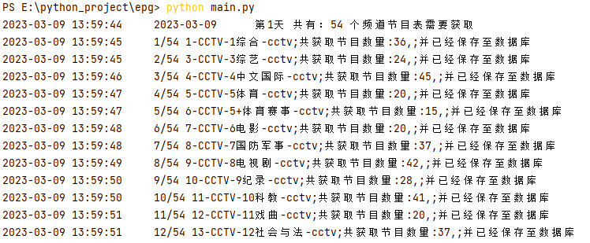
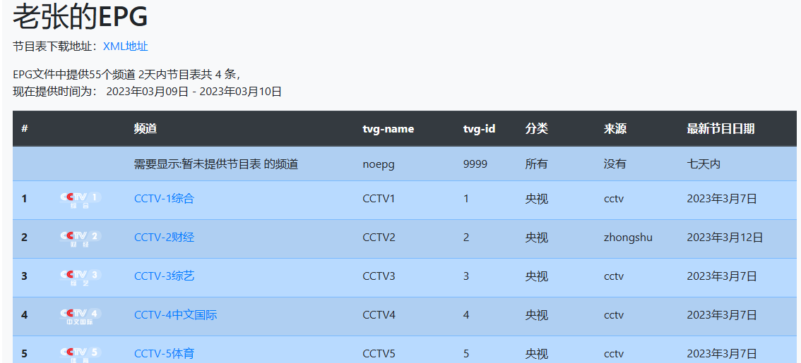
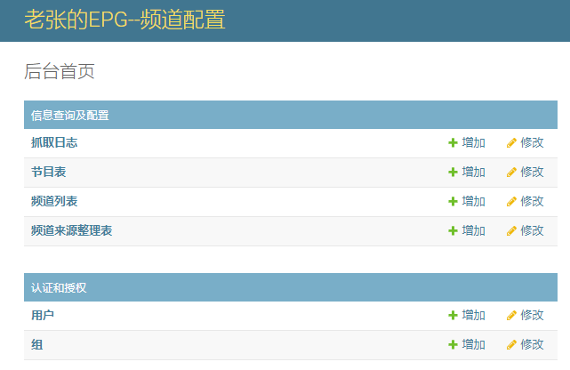
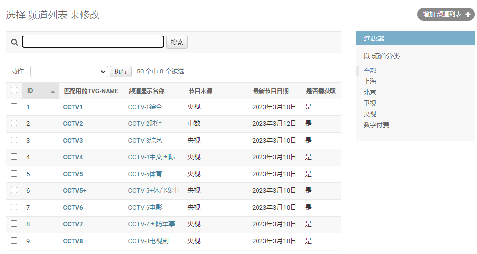
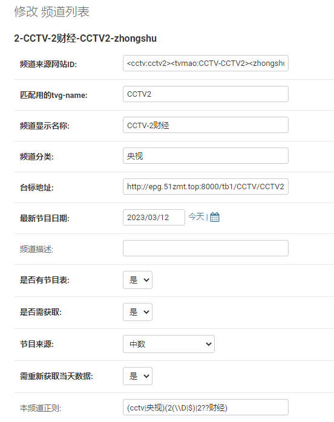

# 老张的EPG  
* 基于`python3`及`django4`的节目表数据抓取及发布系统
* 本人并非专业，很多内容只是为实现功能，可能会有很多BUG，见谅。
* 不保证后续会更新。
* DEMO地址：[老张的EPG](http://epg.51zmt.top:8000/)  

## 主要功能  
- 从网上抓取各来源的节目表信息并生成[xmltv](http://wiki.xmltv.org/) 格式文件，用于[perfect player](http://niklabs.com/) 等APP直接载入的节目表信息。
- 后台配置频道获取列表及抓取日志。
- 抓取失败时自动更换来源。
- 各数来源提供节目表的频道获取
- 提供向外发布的接口
- 使用nginx+uwsgi+MYSQL、普通办公电脑经长期测试，一天DIYP接口访问量可千万以上。  

## 节目表来源  
- 电视猫
- 搜视
- 央视
- 中数
- 台湾宽频
- 中华电信
- 香港有线宽频caletv
- 台湾四季电视
- 香港有线宽频i-cable
- 香港NOWTV
- 香港无线电视
- 北京卫视
- 广东卫视
- 香港卫视
- viutv
- 川流TV
- myTVSUPER  
## 需求  
- requests
- django
- BeautifulSoup  
## 使用方法
默认使用[sqlite3](https://www.sqlite.org/) 数据库  
### 下载源码  
```git clone http://github.com/supzhang/```  
### 抓取数据  
```python
python main.py  #抓取数据并存入数据库，可设置为定时任务
python main.py -channel #抓取所有来源的频道
python main.py -n CCTV1 #单独测试某一频道  
```
另：抓取的频道会加入Channel_list表，需要自己手动整理进Channel表中才可以抓取
  
### 启动后台及接口
#### 启动后台
```python
python manage.py runserver 0.0.0.0:80
```
#### 访问  
浏览器访问[http://127.0.0.1](http://127.0.0.1)查看已有数据抓取情况。  
  
浏览器访问[http://127.0.0.1/admin](http://127.0.0.1/admin) 打开后台（用户名密码：`admin/admin`)  
- 后台首页  
  
- 频道列表    
  
- 修改频道   

- DIYP接口`http://127.0.0.1/api/diyp/` 需要提供参数`?ch=CCTV1&date=20230309` 
### 程序配置  
`util/general` 中有大部分配置  
`crawl_info`:需要采集的节目天数、生成xml的天数、是否需要换源等  
`dirs`:生成测试文件目录
`chuanliu_Authorization`:如果使用川流TV来源，需要提供此信息
### 其他配置  
#### 更改数据库    
`epg/settings`在此文件中修改配置如下：
```python
DATABASES = {
    'default': {
            'ENGINE': 'django.db.backends.mysql',
            'NAME': '数据库名称',
            'USER': '数据库密码',
            'PASSWORD': '数据库密码',
            'HOST': '127.0.0.1',
            'PORT': '3306',
    },
}
```
#### 增加抓取来源  
`crawl/spider`在此文件夹中复制当前存在的采集程序，对其进行修改，主要设置两个方法get_epgs_xxx，get_channels_xxx
`crawl/spider/__init__.py` 中导入上面设置的方法，并参照其他来源加入：epg_funcs,epg_source,func_args,__all__  
#### 增加其他频道  
在后台“频道列表”中增加，“频道来源网站ID:”字段使用`<来源名:id>`格式设置。
****
## 捐赠
如果您觉得本项目对您有所帮助，请您多多支持，您的支持是我最大的动力，多谢。  
- 支付宝  
  
- 微信  


